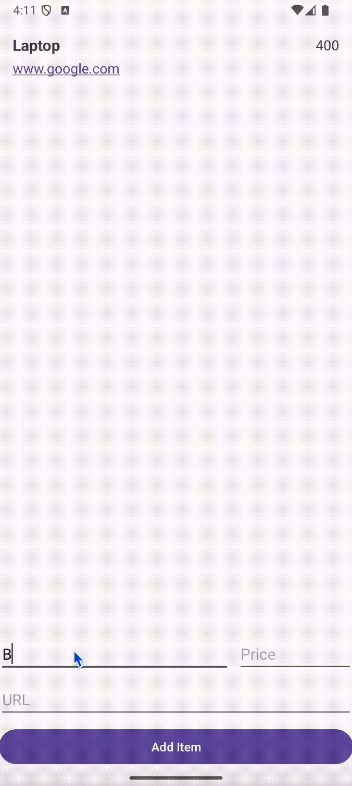

# Android Project 2 - *Wishlist*

Submitted by: **Jaylin Boyce**

**Wishlist** is a wishlist app that helps the user keep track of what they want to buy.

Time spent: **5** hours spent in total

## Required Features

The following **required** functionality is completed:

- [X] **User can add an item to their wishlist**
- [X] **User can see their list of items based on previously inputted items**

## Video Walkthrough

Here's a walkthrough of implemented user stories:

<!-- Replace this with whatever GIF tool you used! -->
GIF created with ...  
[Kap](https://getkap.co/) for macOS
